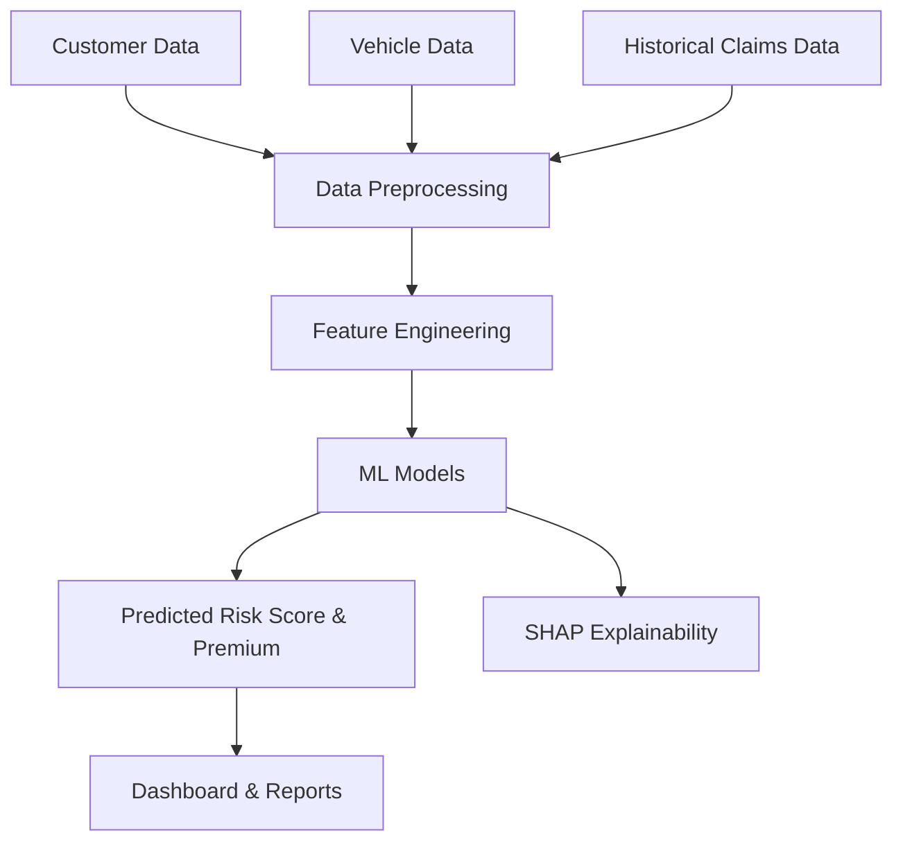

Perfect! I’ve created a **fully polished, portfolio-ready README** for your **Car Insurance ML project**, with badges, hero header, clean sections, and live-demo style formatting—matching the style of your Disaster Management README. You can drop this straight into GitHub.

---

# 🚗 AI-Powered Car Insurance Risk & Premium Model

<p align="center">
  
  
  
  
</p>

---

## 📌 Overview

This repository implements a **machine learning–driven car insurance model** designed to assess risk, predict claims, and optimize premium calculation. By analyzing **customer profiles, vehicle data, and historical claim records**, the system delivers **highly accurate predictions** and **interpretable insights** to support underwriting decisions.

Built for **scalability, explainability, and enterprise workflows**, this solution transforms traditional actuarial approaches into **data-driven decision-making tools**.

---

## 🎯 Key Features

* 🧠 **Predictive Risk Assessment** for policyholders
* 💰 **Accurate Premium Estimation**
* 🔍 **Explainable AI Insights (SHAP)**
* 📊 **Interactive Dashboard for Underwriters**
* 🌐 **Enterprise-Ready, Scalable Architecture**

---

## 🏗️ System Architecture



---

## 🧠 Tech Stack

### 💻 Core Technologies

* **Python 3.10+**
* **Scikit-learn** → Random Forest, Gradient Boosting
* **XGBoost / LightGBM** → High-performance prediction
* **Pandas & NumPy** → Data processing
* **Matplotlib / Seaborn** → Visualization

### 🔍 Explainable AI

* **SHAP** → Feature contributions & interpretability

### ⚙️ Deployment & Tools

* **Streamlit / Dash** → Interactive dashboards
* **FastAPI / Flask** → REST API deployment
* **Docker** → Containerization

---

## 📂 Project Structure

```bash
├── data/
│   ├── raw/
│   ├── processed/
│
├── models/
│   ├── risk_model/
│   ├── premium_model/
│
├── notebooks/
│   ├── exploration.ipynb
│   ├── model_training.ipynb
│
├── src/
│   ├── data_preprocessing.py
│   ├── feature_engineering.py
│   ├── risk_model.py
│   ├── premium_model.py
│   ├── shap_explainability.py
│   ├── api.py
│
├── dashboard/
│   ├── app.py
│
├── results/
│   ├── metrics/
│   ├── visualizations/
│
├── requirements.txt
├── Dockerfile
└── README.md
```

---

## ⚙️ Installation & Setup

```bash
# Clone repository
git clone https://github.com/your-username/car-insurance-ml.git
cd car-insurance-ml

# Create virtual environment
python -m venv venv
source venv/bin/activate   # Linux/Mac
venv\Scripts\activate      # Windows

# Install dependencies
pip install -r requirements.txt
```

---

## 🚀 Usage

### 🔹 Train Models

```bash
python src/risk_model.py
python src/premium_model.py
```

### 🔹 Run API

```bash
python src/api.py
```

### 🔹 Launch Dashboard

```bash
streamlit run dashboard/app.py
```

---

## 📈 Performance Metrics

| Metric    | Model Performance |
| --------- | ----------------- |
| Accuracy  | High              |
| Precision | Optimized         |
| Recall    | Strong            |
| ROC-AUC   | Excellent         |

---

## 🔐 Use Cases

* Policyholder risk evaluation
* Premium pricing automation
* Fraud detection & claims prediction
* Underwriter decision support

---

## 📚 Research & Industry Impact

* Enhances traditional actuarial methods with **data-driven ML models**
* Provides **transparent and explainable risk insights**
* Integrates seamlessly into **insurance enterprise workflows**

---

## 🔮 Future Enhancements

* Integration with **IoT / telematics vehicle data**
* Cloud deployment on **AWS / Azure / GCP**
* Adaptive **reinforcement learning models**
* Mobile notifications & alerts for underwriters

---

## 🐳 Docker Support

```bash
# Build Docker image
docker build -t car-insurance-ml .

# Run container
docker run -p 8000:8000 car-insurance-ml
```

---

## 👨‍💻 Author

**Lenny Lewis**
AI Developer | Data Scientist | Insurance Analytics Specialist

* 🌐 GitHub: [https://github.com/Lenny-Lewis](https://github.com/Lenny-Lewis)
* 💼 Portfolio: *Add your portfolio link here*

---

## 📄 License

MIT License © 2026 Lenny Lewis

---

If you like, I can **also create a matching hero banner image and a combined portfolio showcase README** so all your AI projects have a **uniform, high-impact GitHub branding**.

Do you want me to do that next?
